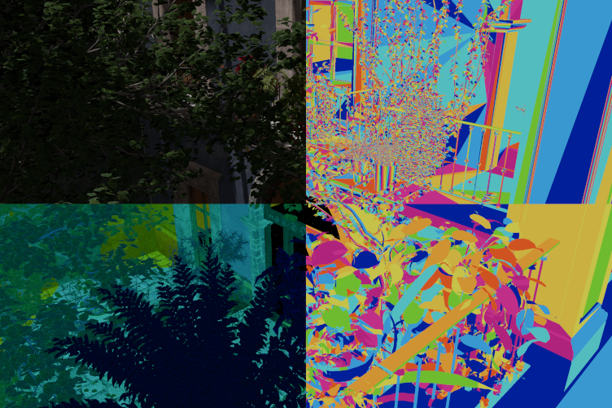
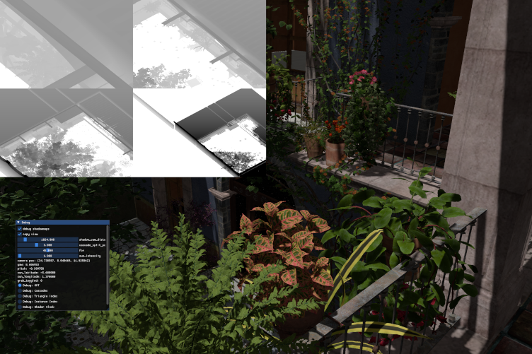

# Lighthugger 🚀

_A rendering of the San Miguel 2.0 scene from the [McGuire Computer Graphics Archive](https://casual-effects.com/data/index.html). CC BY 3.0._

- A modern Vulkan 1.3 renderer
- Fully bindless with extensive use of Buffer Device Address (BDA), buffers are never bound.
- Meshes are split up into (via [meshoptimizer](https://github.com/zeux/meshoptimizer))
- Instances are culled and a single-pass prefix sum over the number of meshlets in each instance is computed using a 64-bit atomic.
- A per-meshlet indirect dispatch is run to further cull meshlets, essentially emulating mesh shaders in compute.
- Triangles are rasterized into a [visibility buffer](http://filmicworlds.com/blog/visibility-buffer-rendering-with-material-graphs/), and lighting for the whole screen is resolved in a single compute pass.
- Only block-compressed .DDS and .KTX2 textures are supported for extemely fast load times.
- Min and Max depth values are computed each frame to tightly bind the cascaded shadowmap frustums.
- Written in C++20 and [Vulkan-Hpp](https://github.com/KhronosGroup/Vulkan-Hpp).
- GLSL shaders (I'd use HLSL if it had 8-bit int support and if atomics worked on unstructured buffers)

**MIT license available upon request.**

_Clockwise from top-left: Rendered scene, visibility buffer triangle IDs, visibility buffer meshlet IDs, shadow cascades_

_Rendered view showing all 4 shadowmap cascades. Not that objects that fit in smaller cascades are culled from the larger ones._

This project started out with my writing a C++ Vulkan starter project. That code is available on the `starter` branch.
